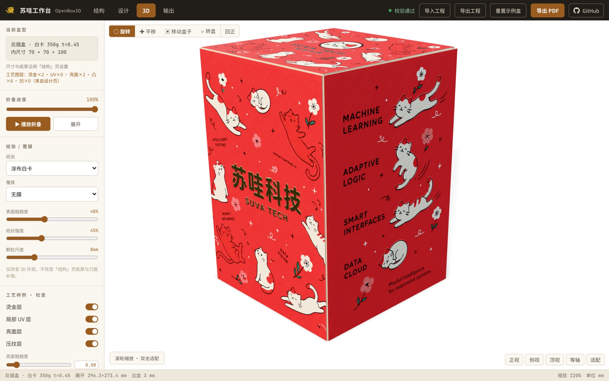
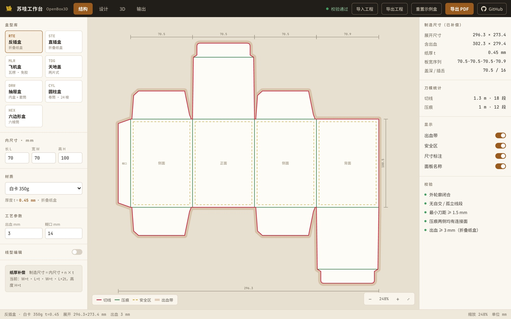
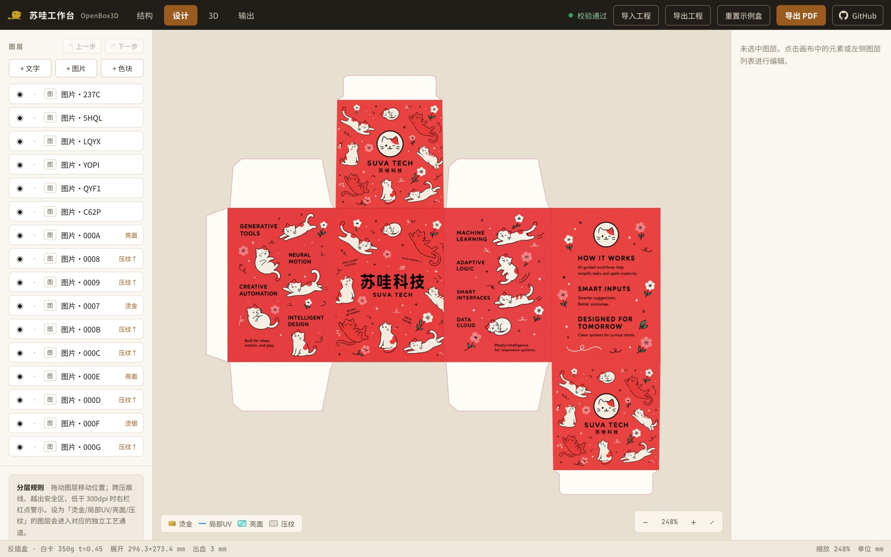

<div align="center">



# OpenBox3D · 苏哇工作台

**Browser-based packaging design workbench — parametric dielines, layered artwork design with print finishes, PBR 3D folding preview, and press-ready PDF export.**

中文速览见下文 [中文说明](#中文说明)。

[License: MIT](#license) · [Quick Start](#quick-start) · [Features](#features)

**[▶ Live Demo — yuyou-dev.github.io/OpenBox3D](https://yuyou-dev.github.io/OpenBox3D/)**（纯前端，打开即玩）

</div>

---

## Features

- **Parametric dielines** — 7 box templates (tuck-end, mailer, tray/lid, drawer, sleeve, tube…), all dimensions in millimetres with paper-thickness compensation, bleed and safe-area guides, plus manual node/edge editing stored as replayable overrides.
- **Layered design canvas** — text, image and shape layers bound to panels, with alignment, rotation, opacity, 300-dpi warnings, and per-layer **print finish channels**: foil (gold/silver), spot UV, gloss, emboss/deboss.
- **Real-time PBR 3D preview** — three.js `MeshPhysicalMaterial` with baked albedo / normal / roughness / metalness / clearcoat / displacement channels. Watch the flat sheet fold into the finished box; paper grain, lamination film, foil and embossing stack naturally in one material.
- **Studio & materials** — 8 built-in studio scenes (HDRI + light rigs), 7 CC0 PBR ground stages, and paper/film presets with grain, roughness, gloss and emboss controls.
- **Press-ready PDF export** — 1:1 CMYK 300 dpi production PDFs with TrimBox/BleedBox, CutContour/Crease spot-colour overprint, plus DeviceGray finish separations (foil / UV / gloss / emboss).
- **`.boxproj` project files** — save and share your work as a single local JSON file (pure client-side, no server, no account).
- **Zero backend** — everything runs in your browser. No API keys, no cloud, no telemetry.

> This is the open-source edition of the Box3D workbench. It intentionally ships **without** AI image generation, AR/iOS preview, DXF export and the experimental material/environment lab.

## Screenshots

<div align="center">

<br><sub>结构 Structure — parametric dieline with thickness compensation, bleed/safe guides and validation</sub>
<br><br>

<br><sub>设计 Design — layered artwork on the unfolded sheet, with foil / spot-UV / gloss / emboss channels</sub>
<br><br>

<br><sub>3D — real-time PBR folding preview with studio scenes and inspection modes</sub>
</div>

## Quick Start

Requirements: **Node.js ≥ 18** and npm. No install? Try the **[live demo](https://yuyou-dev.github.io/OpenBox3D/)** first — the whole app is static and runs entirely in your browser.

```bash
git clone https://github.com/yuyou-dev/OpenBox3D.git
cd OpenBox3D
npm install
npm run dev
```

Open <http://127.0.0.1:26847> — a ready-made sample box greets you in the 3D view, already folded. Start designing right away; no configuration is needed.

Production build:

```bash
npm run build        # includes a template/UV consistency check (prebuild)
npm run preview      # serve the built bundle at the same address
npm run build:pages  # build with base=/OpenBox3D/ for GitHub Pages subpath hosting
```

Note: the dev server binds to `127.0.0.1` only (not reachable from LAN) — this is a deliberate security baseline.

### Live demo deployment

The site at <https://yuyou-dev.github.io/OpenBox3D/> is built from this repo by [`.github/workflows/pages.yml`](.github/workflows/pages.yml) on every push to `main` (GitHub Pages source: *GitHub Actions*). All rendering, baking and PDF generation happen client-side — the demo is a purely static host.

## Using the workbench

The top bar switches between four workspaces:

1. **结构 Structure** — pick a box template, set inner dimensions (L×W×H mm), board stock and bleed; edit dieline nodes and line types (cut/crease) directly.
2. **设计 Design** — add text / image / shape layers onto the unfolded sheet; assign print finishes; watch cross-crease, safe-area and dpi warnings. Every edit is undoable — 上一步/下一步 buttons or ⌘Z / ⌘⇧Z (Ctrl+Z / Ctrl+Shift+Z).
3. **3D** — fold animation, paper & film materials, finish toggles, studio/ground scenes, inspection modes (foil plate, UV plate, emboss height, UV checker).
4. **输出 Output** — preflight summary, then export the print PDF (CMYK production / professional / RGB review) and finish separation PDFs.

**Import / export project** — the top-bar buttons open and save `.boxproj` files locally. **重置示例盒** restores the built-in sample box.

### Customising the built-in sample box

The first-launch sample box is a standard `.boxproj` bundled at [`src/preset/preset-box.json`](src/preset/preset-box.json) (with its layer images under `public/preset/`). To replace it with your own: design a box in the workbench, use **导出工程** to save the `.boxproj`, then run:

```bash
npm run preset:from -- /path/to/your-project.boxproj
```

The script extracts layer images into `public/preset/` and rewrites the bundled JSON; rebuild/restart to see it.

## Tech stack

- [React 18](https://react.dev) + [Vite 5](https://vitejs.dev) — UI and tooling
- [three.js 0.184](https://threejs.org) — WebGL2 PBR rendering, PMREM environments
- Hand-rolled generators — dieline geometry (mm), PDF writer (CMYK/spot colour)
- No state library, no CSS framework, no server code

```
OpenBox3D/
├── index.html
├── public/            # brand assets, CC0 HDRI environments, PBR ground textures
├── scripts/
│   └── check-template-sync.mjs   # dieline↔3D template consistency check (prebuild)
├── src/
│   ├── dieline/       # parametric dieline templates & geometry authority
│   ├── design/        # layers, images, containers, emboss
│   ├── render3d/      # folding tree, texture baking, materials, lighting, scenes
│   ├── export/        # print PDF + finish separations
│   ├── projects/      # .boxproj file format (local import/export only)
│   ├── preset/        # built-in sample box (edit this to rebrand)
│   ├── state/         # single-store state
│   └── ui/            # four workspaces
```

### Debug URL parameters

Handy during development: `?view=structure|design|three|output`, `?tpl=rte|ste|mailer|lidbase|drawer|cyl|hex`, `?fold=0-100`, `?check=art|foil|suv|gloss|emb|checker`, `?studio=<scene-id>`, `?stage=<stage-id>`, `?expo=0.6-1.8`, `?shadow=0`.

## Credits

- HDRI environments and PBR ground textures: [Poly Haven](https://polyhaven.com) (CC0)
- Fonts: Noto Sans SC / Noto Serif SC / JetBrains Mono (Google Fonts, OFL)
- Brand: 苏哇工作台 (Suwa Workshop)

## License

[MIT](LICENSE) © 2026 yuyou-dev

---

## 中文说明

**OpenBox3D（苏哇工作台）** 是一个纯浏览器的包装盒设计工作台：参数化刀版（纸厚补偿、出血/安全区）→ 分层平面设计（烫金/烫银/局部 UV/亮面/压纹工艺通道）→ three.js PBR 3D 折叠预览 → 1:1 CMYK 印刷 PDF 与工艺分版导出。无需后端、无需账号、无需 API Key。

- **安装运行**：Node.js ≥ 18，`npm install && npm run dev`，打开 <http://127.0.0.1:26847>，首屏即内置示例盒（3D 闭合态），直接开始 DIY。也可直接体验 **[在线 Demo](https://yuyou-dev.github.io/OpenBox3D/)**（纯前端静态托管，GitHub Actions 自动部署）。
- **工程文件**：顶栏「导出工程 / 导入工程」保存与分享 `.boxproj` 本地文件；「重置示例盒」恢复初始状态。
- **替换示例盒**：在工作台设计好盒子 → 顶栏「导出工程」→ `npm run preset:from -- /路径/工程.boxproj`（图片抽取到 `public/preset/`，工程写入 `src/preset/preset-box.json`）。
- **开源边界**：本开源版不含 AI 生图、AR/iOS 预览、DXF 导出与实验性的材质和环境实验室。
- 开发服务器仅绑定 `127.0.0.1`（局域网不可达），属刻意安全基线。
